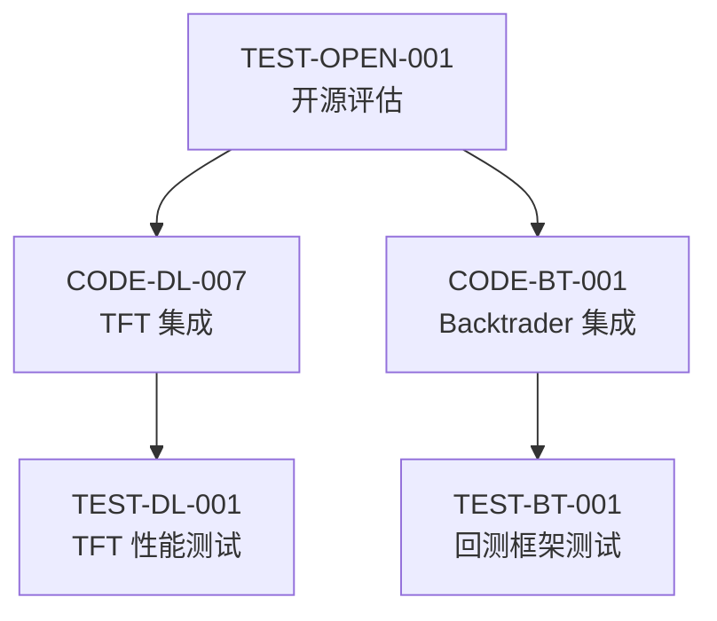

# 开源集成任务进度跟踪

**创建时间:** 2026-03-06 11:36  
**协调负责人:** qclaw-pm  
**优先级:** 🔥 P0 (最高)

---

## 📋 任务清单

### Coder 任务 (3 个 P0 任务)

| 任务 ID | 任务名称 | 状态 | 负责人 | 预计工时 | 实际开始 | 预计完成 |
|---------|---------|------|--------|----------|----------|----------|
| CODE-DL-007 | TFT 模型集成 | 🔄 进行中 | qclaw-coder | 3-4 天 | 2026-03-06 11:36 | 2026-03-10 |
| CODE-BT-001 | Backtrader 集成 | ⏳ 待开始 | qclaw-coder | 3-4 天 | - | - |
| CODE-DATA-001 | yfinance 集成 | ⏳ 待开始 | qclaw-coder | 1-2 天 | - | - |

### Tester 任务 (3 个 P0 任务)

| 任务 ID | 任务名称 | 状态 | 负责人 | 预计工时 | 实际开始 | 预计完成 |
|---------|---------|------|--------|----------|----------|----------|
| TEST-OPEN-001 | 开源项目评估测试 | 🔄 进行中 | qclaw-tester | 2-3 天 | 2026-03-06 11:36 | 2026-03-09 |
| TEST-DL-001 | TFT 模型性能测试 | ⏳ 等待依赖 | qclaw-tester | 2-3 天 | - | - |
| TEST-BT-001 | 回测框架功能测试 | ⏳ 等待依赖 | qclaw-tester | 2-3 天 | - | - |

---

## 🔄 依赖关系

---

## 📊 检查记录

### 2026-03-06 11:36 - 任务启动
- [x] 读取 coder.md 和 tester.md
- [x] 更新 CODE-DL-007 状态为"进行中"
- [x] 更新 TEST-OPEN-001 状态为"进行中"
- [x] 发送飞书通知给 qclaw-coder 和 qclaw-tester
- [x] 创建进度跟踪文件
- [ ] 第一次进度检查 (11:41)

---

## ⚠️ 阻塞问题

当前无阻塞。

---

## 📝 下次检查

**时间:** 2026-03-06 11:41 (5 分钟后)

**检查内容:**
1. qclaw-coder 是否开始评估 pytorch-forecasting
2. qclaw-tester 是否开始准备测试环境
3. 是否有任何阻塞问题

---

## 📈 完成标准

- [ ] CODE-DL-007 完成 (MSE < 0.030, Sharpe > 2.0)
- [ ] CODE-BT-001 完成 (回测框架可运行)
- [ ] CODE-DATA-001 完成 (数据获取正常)
- [ ] TEST-OPEN-001 完成 (评估报告输出)
- [ ] TEST-DL-001 完成 (TFT 性能验证)
- [ ] TEST-BT-001 完成 (回测框架验证)
- [ ] 飞书汇报完成

